# Master Swarm Architecture & Catalog (v4.0 Sovereign Edition)
================================================================

Affordable Home AC (AHAC) — Autonomous Agent Fleet & Analytics Swarm Architecture.
This document provides the authoritative, exhaustive taxonomy of the entire project
from repository root to all component files, folders, Sub-Masters, agents, and SOPs.

---

## 1. Project Directory & File System Taxonomy (Root to Leaf)

Every file and directory across this monorepo operates under the governance of the Sovereign Master Engine and its 6 Sub-Master domains:

```
ahacws26/ (Project Root)
├── .cursorrules                               # Core system prompt & Sovereign Constitution rules
├── agent_catalog.md                           # This document: Master Catalog & Swarm Taxonomy
├── docker-compose.prod.yml                    # Production blue/green container orchestration
├── docker-compose.yml                         # Local staging & development container topology
├── pnpm-workspace.yaml                        # Monorepo package manager boundaries
├── package.json                               # Workspace scripts & shared toolchain
│
├── _analytics_data/                           # Google Search Console & GA4 Ingestion Data Layer
│   ├── August-SEO-Report-09012026/            # GSC August 2026 performance export (Queries, Pages, Chart)
│   ├── July-SEO-Report-08022026/              # GSC July 2026 performance export
│   ├── June-SEO-Report-07012026/              # GSC June 2026 performance export
│   ├── Coverage-Drilldown-20260501/           # Google index coverage & crawl diagnostics
│   ├── Queries.csv                            # Aggregated 1,000-query opportunity dataset
│   ├── Pages.csv                              # Aggregated route impression & CTR dataset
│   └── Reports_snapshot (2).csv               # Historical keyword rank & search volume telemetry
│
├── apps/
│   ├── api/                                   # Core FastAPI Backend & Intelligence Services
│   │   ├── Dockerfile                         # Python 3.12 Alpine multi-stage hardened runner
│   │   ├── main.py                            # ASGI entrypoint, middleware, and route mounting
│   │   ├── database.py                        # Async SQLAlchemy session factory & asyncpg connection pool
│   │   ├── models.py                          # PostgreSQL relational schema (Leads, Orders, Products, Audit)
│   │   ├── schemas.py                         # Pydantic V2 serialization & validation contracts
│   │   ├── dependencies.py                    # SHA-256 HMAC tokens & Dev OS session validators
│   │   ├── cache.py                           # Redis TCP client & circular telemetry buffer
│   │   ├── routers/
│   │   │   ├── dev_os.py                      # Sovereign Master Cockpit API & 24 Agent Runners
│   │   │   ├── dev_os_sops.py                 # 30 Standard Operating Procedures (SOPs) Registry
│   │   │   ├── checkout.py                    # Stripe payment intent & session checkout endpoints
│   │   │   ├── webhooks.py                    # Stripe webhook listener & stock reservation guard
│   │   │   ├── leads.py                       # CRM intake & Oahu appointment dispatching
│   │   │   └── products.py                    # Storefront product catalog & inventory feed
│   │   └── services/
│   │       ├── analytics_swarm.py             # GSC/GA4 parser & Continuous CRO recommendation engine
│   │       ├── email.py                       # Dark-mode transactional email dispatch (Admin & Customer)
│   │       ├── pdf.py                         # PDF receipt & pre-approved rebate form generator
│   │       └── reconciliation.py              # Stripe-to-Postgres order reconciliation worker
│   │
│   ├── dev-os/                                # Dev OS Autonomous Operations Cockpit (Standalone Next.js)
│   │   ├── Dockerfile                         # Node.js 18 runner (capping memory to 384MB)
│   │   ├── app/
│   │   │   ├── page.tsx                       # Master Cockpit UI, 6 Sub-Master clusters, Analytics Radar
│   │   │   ├── layout.tsx                     # Zero-telemetry isolated layout
│   │   │   ├── robots.ts                      # Strict noindex/nofollow exclusion for search crawlers
│   │   │   └── sopsData.ts                    # Visual SOP dossiers & agent instruction data
│   │   └── public/                            # Static cockpit assets
│   │
│   └── web/                                   # Customer-Facing Storefront & Conversion Surfaces
│       ├── Dockerfile                         # Next.js 14 App Router production runner
│       ├── app/
│       │   ├── page.tsx                       # High-converting homepage & localized CTA banners
│       │   ├── shop/
│       │   │   ├── page.tsx                   # LG Dual Inverter storefront, Room Sizer & Plug Filter
│       │   │   └── window-ac-plug-guide/      # 115V vs 230V visual plug guide (NEMA 5-15P vs 6-20P)
│       │   ├── clean-vs-replace-window-ac/    # 3-step decision tool, HECO comparison, $45 rebate form
│       │   ├── window-ac-installation/        # Jalousie bracket mounting, zero-deposit intake form
│       │   ├── mini-split-estimate/           # Multi-zone sizing wizard, 60A/100A electrical panel audit
│       │   ├── window_ac_maintenance/         # $275 Waipahu teardown service with Clean-vs-Replace bridge
│       │   ├── mini_split_ac/                 # Mini split overview (0% Hawaii Energy rebate honesty)
│       │   ├── mini_split_ac_maintenance/     # Mini split cleaning & mold flush procedures
│       │   ├── service-areas/                 # 22 Oahu city landing pages with localized JSON-LD
│       │   ├── contact/                       # "By Appointment First" customer booking intake
│       │   ├── checkout/                      # Direct Stripe checkout bridge
│       │   └── sitemap.ts                     # XML Sitemap generator for all indexed conversion routes
│       ├── components/                        # Tree-shaken UI components (Lucide React, Tailwind CSS)
│       │   ├── MiniSplitEstimator.tsx         # Multi-step zone calculator & panel load intake
│       │   ├── BackToTop.tsx                  # Floating navigation anchor
│       │   └── NavbarV2.tsx                   # Unified island header navigation
│       └── public/
│           └── assets/he-rebate-form/         # Pre-approved Hawaii Energy $45 Window AC Application PDF
│
├── scripts/                                   # Master CLI Tools & Security Scanners
│   ├── dev-os.ps1                             # Sovereign CLI control bridge (24 agents, analytics, CRO)
│   ├── scan-secrets.ps1                       # Automated pre-commit & pre-deploy cybersecurity scanner
│   ├── verify-build.ps1                       # Local cross-package compilation check
│   └── sync_local.ps1                         # Workstation-to-VPS deployment synchronizer
│
└── docs/                                      # Enterprise Documentation & Architecture Blueprints
    ├── ANALYTICS_SWARM_ARCHITECTURE.md        # Complete GSC + GA4 Continuous CRO Swarm Specification
    ├── API.md                                 # Backend OpenAPI reference & route contracts
    └── adr/                                   # Architectural Decision Records (ADRs)
```

---

## 2. Sovereign Master & 6 Category Sub-Masters Hierarchy

```mermaid
graph TD
    Master[Sovereign Master Engine<br/>dev-os.py / scripts/dev-os.ps1 / apps/dev-os]
    
    Sub1[Sub-Master 01: Infrastructure<br/>submaster_infrastructure]
    Sub2[Sub-Master 02: Security & Compliance<br/>submaster_security_compliance]
    Sub3[Sub-Master 03: Commerce & Telemetry<br/>submaster_commerce_telemetry]
    Sub4[Sub-Master 04: Growth & Grounding<br/>submaster_growth_grounding]
    Sub5[Sub-Master 05: CRM Operations<br/>submaster_crm_operations]
    Sub6[Sub-Master 06: Deployment Quality<br/>submaster_deployment_quality]

    Master --> Sub1
    Master --> Sub2
    Master --> Sub3
    Master --> Sub4
    Master --> Sub5
    Master --> Sub6

    Sub1 --> A1[agent_host_sentinel]
    Sub1 --> A2[agent_container_sentinel]
    Sub1 --> A3[agent_db_guardian]
    Sub1 --> A4[agent_storage_sentinel]

    Sub2 --> A5[agent_security_shield]
    Sub2 --> A6[agent_commit_sentinel]
    Sub2 --> A7[agent_compliance_auditor]
    Sub2 --> A8[agent_perimeter_auditor]

    Sub3 --> A9[agent_funnel_telemetry]
    Sub3 --> A10[agent_cro_optimizer]
    Sub3 --> A11[agent_revenue_reconciler]
    Sub3 --> A12[agent_cart_telemetry]

    Sub4 --> A13[agent_seo_metadata]
    Sub4 --> A14[agent_oahu_grounding]
    Sub4 --> A15[agent_market_research]
    Sub4 --> A16[agent_heco_rebate_strategist]
    Sub4 --> A17[agent_gsc_ga4_analytics]
    Sub4 --> A18[agent_schema_metadata_engine]
    Sub4 --> A19[agent_high_intent_planner]

    Sub5 --> A20[agent_crm_dispatch]
    Sub5 --> A21[agent_customer_lifecycle]
    Sub5 --> A22[agent_appointment_integrity]

    Sub6 --> A23[agent_build_qa]
    Sub6 --> A24[agent_deployment_guardian]
```



---

## 3. The Complete 24 Specialized Agents Roster

| # | Agent Identifier | Sub-Master Category | Primary Focus & Domain | Associated SOP(s) |
|---|---|---|---|---|
| 01 | `agent_host_sentinel` | Infrastructure | Hostinger VPS CPU, RAM, Disk, Systemd uptime | `SOP-INF-01` |
| 02 | `agent_container_sentinel` | Infrastructure | Docker healthchecks, restart policies, port loopbacks | `SOP-INF-02` |
| 03 | `agent_db_guardian` | Infrastructure | Postgres asyncpg connection pool & WAL checkpoints | `SOP-INF-03` |
| 04 | `agent_storage_sentinel` | Infrastructure | 10MBx3 Docker log caps, tmp file hygiene, DB pruning | `SOP-INF-04` |
| 05 | `agent_security_shield` | Security & Compliance | SHA-256 HMAC tokens, cookie security, secret hygiene | `SOP-SEC-01` |
| 06 | `agent_commit_sentinel` | Security & Compliance | Pre-commit secret scanning, AST checks, build gates | `SOP-SEC-02` |
| 07 | `agent_compliance_auditor` | Security & Compliance | Rolling 14-day audit log retention & PII redaction | `SOP-SEC-03` |
| 08 | `agent_perimeter_auditor` | Security & Compliance | Zero-inbound workstation perimeter & loopback bindings | `SOP-SEC-04` |
| 09 | `agent_funnel_telemetry` | Commerce & Telemetry | GA4 event streaming, drop-off tracking, micro-conversions | `SOP-COM-01` |
| 10 | `agent_cro_optimizer` | Commerce & Telemetry | Storefront friction reduction, CTA hierarchy, value props | `SOP-COM-02` |
| 11 | `agent_revenue_reconciler` | Commerce & Telemetry | Stripe webhook sync, unrecorded transaction healing | `SOP-COM-03` |
| 12 | `agent_cart_telemetry` | Commerce & Telemetry | Cart abandonment tracking, shipping & pickup choices | `SOP-COM-04` |
| 13 | `agent_seo_metadata` | Growth & Grounding | XML sitemap, canonical URLs, robots.txt, SERP tags | `SOP-GRO-01` |
| 14 | `agent_oahu_grounding` | Growth & Grounding | 22 Oahu city pages, local phone/address consistency | `SOP-GRO-02` |
| 15 | `agent_market_research` | Growth & Grounding | Island competitor price tracking & inventory positioning | `SOP-GRO-03` |
| 16 | `agent_heco_rebate_strategist`| Growth & Grounding | HECO ~44.2¢/kWh power economics & $45 rebate rules | `SOP-GRO-04` |
| 17 | `agent_gsc_ga4_analytics` | Growth & Grounding | GSC query clustering, CTR gaps, GA4 funnel telemetry | `SOP-GRO-05` |
| 18 | `agent_schema_metadata_engine`| Growth & Grounding | JSON-LD schema audits (FAQPage, HVACBusiness, HowTo) | `SOP-GRO-06` |
| 19 | `agent_high_intent_planner` | Growth & Grounding | High-yield conversion landing page roadmap & CRO loops | `SOP-GRO-07` |
| 20 | `agent_crm_dispatch` | CRM Operations | "By Appointment First" lead intake & dispatch queue | `SOP-CRM-01` |
| 21 | `agent_customer_lifecycle` | CRM Operations | Annual window AC / biannual mini split recall triggers | `SOP-CRM-02` |
| 22 | `agent_appointment_integrity`| CRM Operations | Zero upfront fee enforcement before customer contact | `SOP-CRM-03` |
| 23 | `agent_build_qa` | Deployment Quality | Next.js compilation, TypeScript strictness, link checks | `SOP-DEP-01` |
| 24 | `agent_deployment_guardian` | Deployment Quality | Blue/green container rebuilds, zero-downtime Nginx reload | `SOP-DEP-02`, `SOP-DEP-03` |

---

## 4. Master Index of the 30 Standard Operating Procedures (SOPs)

### Cluster 1: Infrastructure Operations (`SOP-INF`)
- **`SOP-INF-01`**: Hostinger VPS Host Resource Health Auditing
- **`SOP-INF-02`**: Docker Container Lifecycle & Blue/Green Recreation
- **`SOP-INF-03`**: PostgreSQL 16 Persistence & Connection Pool Governance
- **`SOP-INF-04`**: Anti-Flooding Log Caps & Redis Circular Buffer Capping

### Cluster 2: Security & Zero-Trust Governance (`SOP-SEC`)
- **`SOP-SEC-01`**: Cryptographic HMAC-SHA256 Token Session Verification
- **`SOP-SEC-02`**: Pre-Commit Secret Scanning & Public Bundle Sanitization
- **`SOP-SEC-03`**: Dev OS Rolling 14-Day Audit Logging & PII Masking
- **`SOP-SEC-04`**: Air-Tight Perimeter Verification & Loopback Enforcement

### Cluster 3: Commerce & Telemetry Operations (`SOP-COM`)
- **`SOP-COM-01`**: GA4 Client-Side Funnel Event Tracking & Drop-off Auditing
- **`SOP-COM-02`**: Storefront Conversion Rate Optimization (CRO) Calibration
- **`SOP-COM-03`**: Stripe Webhook Ledger Reconciliation & Ghost Order Recovery
- **`SOP-COM-04`**: Real-Time Inventory Stock Level Caching & Google Shopping Feed

### Cluster 4: Growth, SEO & Island Grounding (`SOP-GRO`)
- **`SOP-GRO-01`**: Technical SEO Architecture, Canonical Tags & XML Sitemaps
- **`SOP-GRO-02`**: 22-City Oahu Local Grounding & Municipal Service Areas
- **`SOP-GRO-03`**: Oahu HVAC Competitive Intelligence & Freight Positioning
- **`SOP-GRO-04`**: Hawaii Energy Rebate Integrity & HECO kWh ROI Anchoring
- **`SOP-GRO-05`**: GSC Query Cluster Ingestion & GA4 Stage Drop-off Analytics
- **`SOP-GRO-06`**: Autonomous JSON-LD Schema Engine & Google SERP Simulator
- **`SOP-GRO-07`**: Continuous High-Intent CRO Page Generation & Funnel Bridging

### Cluster 5: CRM & Customer Operations (`SOP-CRM`)
- **`SOP-CRM-01`**: "By Appointment First" Lead Queue Triage & Dispatch
- **`SOP-CRM-02`**: Oahu Salt-Air Preventative Maintenance Lifecycle Recalls
- **`SOP-CRM-03`**: Waipahu Warehouse Drop-Off Intake & 24-48hr Bench Testing
- **`SOP-CRM-04`**: Customer Direct Pricing Guarantee & Zero Upfront Fee Policy

### Cluster 6: Deployment Quality & Release Engineering (`SOP-DEP`)
- **`SOP-DEP-01`**: Next.js & FastAPI Full-Stack Preflight Build Verification
- **`SOP-DEP-02`**: Zero-Downtime Hostinger VPS Production Deployment Protocol
- **`SOP-DEP-03`**: Rapid Emergency Rollback & State Restoration Procedure

---

## 5. Analytics Swarm Architecture (GSC + GA4 + Continuous CRO Loop)

```
[ GSC Query Data ]              [ GA4 Telemetry ]
_analytics_data/Queries.csv     analytics_swarm_service
         │                               │
         ▼                               ▼
  ┌──────────────────────────────────────────────┐
  │  Ingestion & Clustering Layer               │
  │  apps/api/services/analytics_swarm.py        │
  └──────────────────────┬───────────────────────┘
                         │
                         ▼
  ┌──────────────────────────────────────────────┐
  │  Autonomous Analytics Agent Fleet            │
  │  - agent_gsc_ga4_analytics                   │
  │  - agent_schema_metadata_engine              │
  │  - agent_high_intent_planner                 │
  └──────────────────────┬───────────────────────┘
                         │
         ┌───────────────┴───────────────┐
         ▼                               ▼
  ┌────────────────────────┐   ┌────────────────────────┐
  │  Continuous CRO Stream │   │  JSON-LD Schemas       │
  │  - REC-01: Plug Filter │   │  - FAQPage             │
  │  - REC-02: Clean/Repl  │   │  - HVACBusiness        │
  │  - REC-03: Install Form│   │  - HowTo               │
  │  - REC-04: Panel Calc  │   │  - Product / Offers    │
  └───────────┬────────────┘   └───────────┬────────────┘
              │                            │
              ▼                            ▼
  ┌─────────────────────────────────────────────────────┐
  │  Edge Conversion Surfaces (apps/web/app/)           │
  │  - /clean-vs-replace-window-ac                     │
  │  - /window-ac-installation                         │
  │  - /shop/window-ac-plug-guide                      │
  │  - /mini-split-estimate                            │
  │  - /shop (Interactive Room Sizer & Plug Filter)    │
  └─────────────────────────────────────────────────────┘
```

### High-Yield Conversion Page Blueprint

1. **`/clean-vs-replace-window-ac`**:
   - **Target Query Cluster**: "clean window ac waipahu", "window ac unit cleaning service", "ac cleaning vs replace".
   - **Conversion Catalysts**: 3-step decision calculator (unit age, coil rot, compressor technology); HECO annual energy cost table; dual-funnel CTA ($275 cleaning drop-off OR new LG Dual Inverter purchase with $45 rebate).

2. **`/window-ac-installation`**:
   - **Target Query Cluster**: "window ac installation oahu", "window ac installers near me", "jalousie ac install".
   - **Conversion Catalysts**: Jalousie retrofit bracket diagram; zero upfront deposit intake form; 1-click equipment add-on bundle; Hawaii Contractor License CT-36775 badge.

3. **`/shop/window-ac-plug-guide`**:
   - **Target Query Cluster**: "18000 btu window ac plug type", "230 volt window ac outlet", "nema 6-20p vs 5-15p".
   - **Conversion Catalysts**: Visual plug diagrams (115V NEMA 5-15P vs 230V NEMA 6-20P); unblocks 28 units of 18k (LW1822IVSM) and 18 units of 23.5k (LW2422IVSM); direct Add to Cart buttons with $45 rebate form link.

4. **`/mini-split-estimate`**:
   - **Target Query Cluster**: "mini split cost estimate oahu", "split ac installation near me", "ductless ac honolulu".
   - **Conversion Catalysts**: Strict 0% Hawaii Energy rebate honesty (honest CT-36775 direct pricing, zero bureaucratic delays); complimentary 60A/100A main electrical panel load assessment; interactive multi-zone sizing wizard (`MiniSplitEstimator`).

---

## 6. Master CLI Orchestration (`scripts/dev-os.ps1`)

The Master CLI Bridge provides immediate command-line execution for the entire swarm:

```powershell
# Run the complete 24-agent fleet audit
.\scripts\dev-os.ps1 run-fleet

# Ingest GSC queries and display GA4 conversion telemetry
.\scripts\dev-os.ps1 analytics

# Stream continuous CRO recommendations and cross-funnel bridges
.\scripts\dev-os.ps1 recommendations

# Review active high-intent conversion pages
.\scripts\dev-os.ps1 high-intent-pages

# Audit JSON-LD structured schemas across all routes
.\scripts\dev-os.ps1 schema-catalog

# Browse the 30 Standard Operating Procedures
.\scripts\dev-os.ps1 sops

# Execute a category Sub-Master suite
.\scripts\dev-os.ps1 run-submaster submaster_growth_grounding
```

---

## 7. Air-Tight Security & Grounding Directives

1. **Loopback Binding**: Host ports 3005, 3001, 8001, 5433, and 6380 are strictly bound to `127.0.0.1`.
2. **Zero Public Access**: Dev OS cockpit is barred by `robots.ts` (`Disallow: /`) and protected by SHA-256 HMAC session cookies.
3. **Outbound Sync Only**: Workstation is 100% air-tight; VPS server possesses zero inbound network connectivity to the local development environment.
4. **Mini Split Rebate Truth**: 0% participation in Hawaii Energy rebates (contractor direct pricing, zero red tape).
5. **Window AC Rebate Truth**: Qualifying Energy Star LG Dual Inverters earn a $45 cash rebate using Affordable Home AC's official pre-approved application form PDF (`/assets/he-rebate-form/Affordable-Home-AC-WINDOW-AC-PURCHASE-APP-V4-12.24.24.pdf`).
