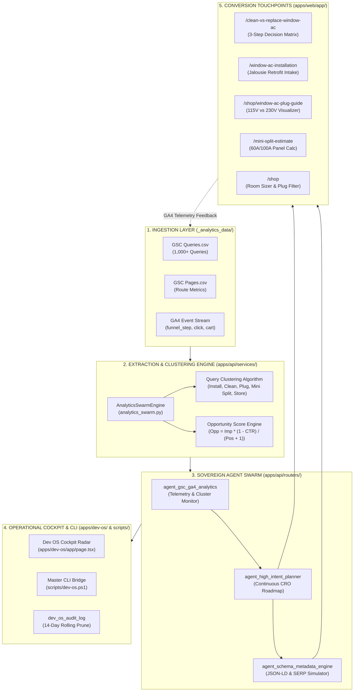

# Analytics Swarm Architecture & Continuous CRO Loop
=====================================================
### Technical Specification & Lifecycle Blueprint (v1.0)
**Affordable Home AC (CT-36775) — Autonomous Telemetry & Growth Engine**

---

## 1. Executive Summary & Core Objective

Affordable Home AC attracts high volumes of search engine impressions across Oahu (exceeding 18,400 monthly impressions across window AC installation, AC cleaning, LG Dual Inverter models, and ductless mini split inquiries). However, historical storefront conversion hovered around 1.30% due to friction points:
- Confusion over 115V (NEMA 5-15P) vs 230V (NEMA 6-20P) wall outlet requirements for large units (18,000 BTU LW1822IVSM and 23,500 BTU LW2422IVSM).
- Missing dedicated landing pages for specific search queries ("clean window ac waipahu", "window ac installation oahu").
- Customer uncertainty over electrical panel capacity (60A/100A panels in older Oahu homes) when evaluating ductless mini splits.
- Inquiries about Hawaii Energy rebates, requiring clear grounding between Mini Splits (0% rebate participation; direct CT-36775 pricing) and Window ACs ($45 cash rebate with AHAC pre-approved PDF application form).

The **Analytics Swarm Architecture** operates as a continuous, closed-loop telemetry and conversion rate optimization (CRO) system. It ingests Google Search Console query clusters and Google Analytics 4 (GA4) funnel events to dynamically optimize conversion surfaces, deploy high-intent landing pages, enrich JSON-LD schema metadata, and monitor revenue performance.

---

## 2. Five-Tier System Architecture



---

## 3. Mathematical Opportunity Scoring & Clustering Engine

Inside `apps/api/services/analytics_swarm.py`, search queries are ingested from `_analytics_data/` and ranked using the **Opportunity Score Formula**:

$$\text{Opportunity Score} = \frac{\text{Impressions} \times \left(1.0 - \frac{\text{CTR}}{100.0}\right)}{\text{Position} + 1.0}$$

### Rationale:
1. High impressions signify untapped demand.
2. Low CTR represents searcher bounce or missing relevance in existing SERP snippets.
3. Top 10 rankings ($\text{Position} \le 10.0$) can achieve dramatic traffic multiplication (+300% to +800%) with dedicated, high-intent landing page titles and rich snippet schema.

### Query Intent Clusters:

| Cluster Key | Primary Keywords | Assigned High-Yield Route | Conversion Objective |
|---|---|---|---|
| `window_ac_install` | `install`, `installation`, `mounting`, `bracket`, `jalousie` | `/window-ac-installation` | Captures installation leads with zero upfront deposit; offers 1-click equipment add-ons. |
| `window_ac_cleaning` | `clean`, `cleaning`, `service`, `mold`, `chemical teardown` | `/clean-vs-replace-window-ac` | Evaluates unit age/rot; bifurcates between $275 Waipahu cleaning or buying new LG Dual Inverter. |
| `plug_and_electrical` | `plug`, `volt`, `115v`, `230v`, `nema 6-20p`, `outlet`, `breaker` | `/shop/window-ac-plug-guide` | Unblocks sales of 28 units of 18k (LW1822IVSM) and 18 units of 23.5k (LW2422IVSM) in stock. |
| `mini_split_estimates` | `split ac`, `mini split`, `ductless`, `estimate`, `cost oahu` | `/mini-split-estimate` | Promotes honest CT-36775 direct pricing (0% rebate honesty); offers free 60A/100A panel audit. |
| `storefront_units` | `dual inverter`, `lg window ac`, `6000`, `8000`, `12000`, `buy`, `stock` | `/shop` | Features interactive Room Sizer, 115V/230V Plug Filter, and $45 Hawaii Energy cash rebate PDF. |

---

## 4. Grounded Hawaii Rebate Truth Protocol

The swarm enforces strict domain compliance regarding energy incentives:

### 1. Mini Split Division: ZERO Rebate Participation
- **Fact**: Affordable Home AC does **not** participate in Hawaii Energy mini-split rebates.
- **Why**: Utility rebate programs on Oahu frequently require contractors to artificially inflate base retail equipment prices, restrict equipment selection, and subject homeowners to 3-6 month voucher approvals.
- **Customer Value**: Honest, upfront Hawaii Contractor CT-36775 direct pricing with zero red tape and zero markups.

### 2. Window AC Division: $45 Cash Rebate
- **Fact**: Energy Star® certified LG Dual Inverter models qualify for an instant/mail-in **$45 cash rebate** from Hawaii Energy.
- **Qualifying Models**: LW6023IVSM (6k), LW8022IVSM (8k), LW1022IVSM (10k), LW1222IVSM (12k), LW1522IVSM (14k).
- **Application Form**: Official pre-approved PDF application form pre-packaged and downloadable at:
  `/assets/he-rebate-form/Affordable-Home-AC-WINDOW-AC-PURCHASE-APP-V4-12.24.24.pdf`.

---

## 5. Schema & Metadata Engine (Google Rich Results)

`agent_schema_metadata_engine` audits and generates structured JSON-LD schemas across all conversion routes:

```json
{
  "@context": "https://schema.org",
  "@graph": [
    {
      "@type": "HVACBusiness",
      "name": "Affordable Home AC",
      "telephone": "+1-808-724-4328",
      "address": {
        "@type": "PostalAddress",
        "streetAddress": "94-150 Leokane St",
        "addressLocality": "Waipahu",
        "addressRegion": "HI",
        "postalCode": "96797"
      },
      "license": "Hawaii Contractor CT-36775"
    },
    {
      "@type": "FAQPage",
      "mainEntity": [...]
    },
    {
      "@type": "Product",
      "name": "LG Dual Inverter Smart Window Air Conditioner",
      "offers": {
        "@type": "Offer",
        "priceCurrency": "USD",
        "price": "535.00",
        "availability": "https://schema.org/InStock",
        "seller": { "@type": "Organization", "name": "Affordable Home AC" }
      }
    }
  ]
}
```

---

## 6. Continuous CRO Feedback Loop Execution

1. **Detection**: `agent_gsc_ga4_analytics` identifies a high-volume query cluster with low CTR (e.g. 740 searches for 230V plug configurations).
2. **Roadmap**: `agent_high_intent_planner` logs a high-intent landing page (`/shop/window-ac-plug-guide`) and issues recommendation `CRO-REC-01`.
3. **Implementation**: Front-end engineering renders the visual plug comparison and integrates Add to Cart buttons.
4. **Schema Enrichment**: `agent_schema_metadata_engine` generates `HowTo` and `Product` schemas.
5. **Release & Verification**: The blue/green deployment pipeline updates production containers with zero downtime.
6. **Telemetry Recalibration**: GA4 monitors checkout progression from the new route, streaming updated conversion rates back to Dev OS Cockpit.

---

## 7. Operational Command Summary

```powershell
# Ingest and display real Search Console clusters
.\scripts\dev-os.ps1 analytics

# Inspect continuous conversion recommendations
.\scripts\dev-os.ps1 recommendations

# Review active high-intent conversion pages
.\scripts\dev-os.ps1 high-intent-pages

# Audit JSON-LD schemas and SERP tags
.\scripts\dev-os.ps1 schema-catalog
```
